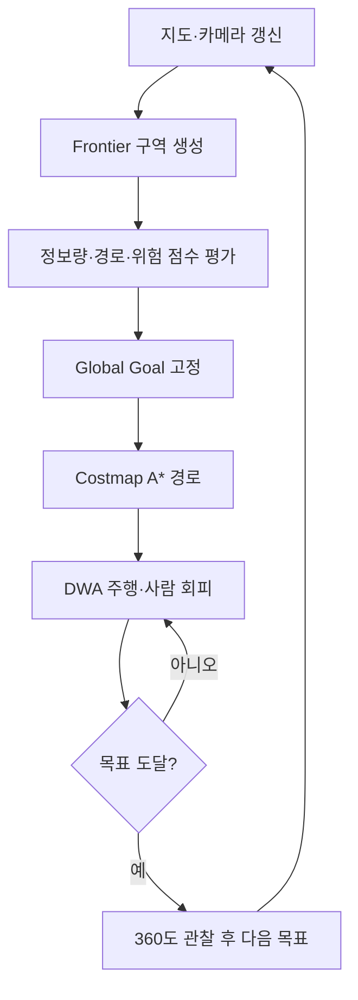

# Team_Neon — TurtleBot3 자율 수색·구조 (Search & Rescue)

2026 PNU CSE Tech Week Hackathon · Team Neon

## 프로젝트 개요

사전 지도가 없는 아파트 환경에서 TurtleBot3 Burger가 스스로 지도를 만들며 탐색합니다.
**지정한 색의 사과(목표물)를 찾아 접근한 뒤 출발 위치·방향으로 돌아오는** Webots 시뮬레이션 프로젝트입니다.

| 항목 | 내용 |
|---|---|
| 시뮬레이터 | Webots **R2025a** |
| 로봇 | TurtleBot3 Burger (LDS-01 LiDAR, 카메라, IMU/Gyro, 휠 엔코더) |
| 목표물 | 빨강·초록·보라·주황 사과 중 지정한 색 (`TARGET_COLOR`, 기본 `"red"`) |
| 방해 요소 | 다른 색 사과(디코이), 가구, 걸어다니는 보행자 |
| 사용 금지 | GPS, 나침반, Ground truth (대회 규칙) |
| 주 컨트롤러 | [`HyunaPark/tb3_teleop.py`](HyunaPark/tb3_teleop.py) |

미션: `START → 미지 공간 탐색 → 장애물·사람 회피 → 사과 발견·접근 → 출발점 복귀 → 시작 방향 정렬 → FINISH`

### 개발 과정: "사과 2개"에서 "있는 사과 모두"로

처음 코드는 **빨간 사과 2개**를 찾는 것이 목표였습니다. 목표 개수를 알고 있으니 2개를 찾는 즉시 복귀하면 되었고, 탐색 효율이 조금 떨어져도 문제가 크지 않았습니다.

하지만 **사과가 몇 개인지 모르는 상황**에서 모두 찾으려면 로봇이 제한 시간 안에 집 전체를 빠짐없이, 같은 곳을 반복하지 않고 돌아봐야 합니다.
기존 탐색 방식을 분석해 보니 다음 문제가 있었습니다.

| 기존 방식 | 문제 |
|---|---|
| Frontier **셀** 가운데 BFS로 가장 먼저 닿는 셀을 목표로 선택 | 조금 이동하고 다시 목표를 정하다 보니 같은 구역을 반복 방문 |
| 목표를 **거리**만으로 선택 | 가까워도 새로 볼 것이 없는 곳에 시간을 씀 |
| 지도를 통과 가능 / 불가능 **이진**으로 구분 | 벽에 붙은 길과 넓은 길을 구분하지 못함 |
| 안전 반경을 여러 번 줄여 가며 **BFS** 재시도 | 모든 칸의 비용이 같아서 좁은 통로도 넓은 길과 똑같이 취급 |
| 사람이 지나가면 전역 목표까지 다시 계산 | 목표가 자주 바뀌어 주행이 흔들림 |

그래서 탐색 효율과 주행 안정성에 가장 큰 영향을 주는 부분부터 다음 순서로 고쳤습니다.

**Frontier 군집화·점수화 → Costmap → A\* → 대각선 충돌 검사 → Display 시각화**

## 주요 특징

- **센서 규칙 준수 위치 추정:** 휠 오도메트리와 Gyro/IMU 방향을 쓰고, LiDAR 스캔 매칭으로 누적 오차를 보정합니다.
- **Occupancy Grid 매핑:** LiDAR로 log-odds 점유 격자 지도(0.10 m 해상도)를 실시간으로 만듭니다.
  카메라가 실제로 본 바닥은 별도의 **카메라 관측 지도**에 기록합니다.
- **Frontier 구역 탐색:** 경계 셀을 연결된 구역으로 묶고, 구역마다 안전한 대표 목적지를 정합니다.
- **점수 기반 목적지 선택:** 정보 획득량·경로 비용·재방문·위험을 함께 고려합니다.
- **연속 Costmap + A\*:** 벽에서 멀수록 비용이 낮은 지도 위에서 A\*로 전역 경로를 만듭니다.
- **DWA 지역 계획:** 실제 로봇 외형과 **예측한 보행자 위치**를 반영해 속도를 결정합니다.
- **목표 인식:** YOLO11n으로 사과 후보를 찾고 색상·크기로 다시 확인합니다. 모델이 없으면 색 검출로 동작합니다.
- **판단 근거 시각화:** 지도 Display에 Costmap, Frontier, 목표, 경로, DWA 궤적을 색으로 구분해 표시합니다.

## 시스템 흐름



| 계층 | 역할 | 다시 계산하는 시점 |
|---|---|---|
| **Global Goal** | 정보 획득량이 큰 Frontier 구역 하나를 선택하고 최소 15초 유지 | 도착했을 때, 더 볼 것이 없어졌을 때 |
| **Global Path** | Costmap 위에서 A\*로 목표까지 안전한 전체 경로 생성 | 경로가 2초 이상 **실제로** 막혔을 때, 경로에서 크게 벗어났을 때 |
| **Local Planner** | DWA로 사람·순간 장애물을 피하거나 멈추며 경로 추종 | 매 제어 주기 |

사람이 잠깐 지나간다고 Global Goal을 바꾸지 않습니다. DWA가 피하거나 정지하고, 기존 경로가 계속 막혀 있을 때만 A\*를 다시 실행합니다.

미션 상태 머신:

```text
EXPLORE ──(360° 둘러보기)──▶ SWEEP ──▶ EXPLORE
   ├─(사과 발견)──▶ APPROACH ──(도착)──▶ DWELL ──▶ EXPLORE …
   ├─(남은 미관측 구역)──▶ LOOK
   └─(탐색 완료 / 시간 부족)──▶ RETURN ──▶ ALIGN ──▶ FINISH
어느 상태에서든 끼임 감지 → RECOVER → 원래 상태로 복귀
```

## 창의적 특징

### 1. Frontier를 점이 아닌 구역으로 묶기
```text
Frontier 검출 → 연결된 셀끼리 그룹화(8방향) → 너무 작은 그룹 제거 → 그룹마다 대표 목적지 선정
```
- 긴 경계는 2 m 단위로 나눠 여러 목적지로 만듭니다.
- 대표 목적지는 Frontier 한가운데가 아니라 **안전한 빈 공간 쪽으로 약 0.35 m 물러난 셀**입니다. 그 셀에서 Frontier가 직접 보이는지도 확인합니다.
- 기준점에서 걸어서 4 m 이내의 **작업 구역**을 먼저 마친 뒤 다음 구역으로 넘어갑니다. 멀리 있는 후보가 가까운 남은 일을 가로채지 않게 하기 위해서입니다.

### 2. 목적지를 점수로 선택하기

$$
score = 2.0 \times informationGain - 1.0 \times pathCost - 1.5 \times revisitPenalty - 2.0 \times riskCost
$$

| 항목 | 계산 방법 |
|---|---|
| informationGain | 목적지에서 반경 3 m로 광선 120개를 쏘아, 벽에 가리지 않고 보이는 미지 공간 넓이 [m²] |
| pathCost | A\*로 구한 실제 경로 비용 (직선거리 아님) |
| revisitPenalty | 이미 여러 번 지나간 지역에 대한 감점 |
| riskCost | 경로가 벽·좁은 통로에 가까운 정도 |

현재 위치에서 실제로 갈 수 있으면서 새로운 공간을 많이 볼 수 있는 목적지를 고릅니다.
점수의 상한으로 후보를 먼저 정렬해서, 가망 없는 후보에는 A\*를 돌리지 않습니다.

### 3. 이진 장애물 지도 → 연속 Costmap

| 영역 | 처리 |
|---|---|
| 장애물 | 통과 불가능 |
| 로봇이 충돌하는 최소 경계 (외접 반지름 + 여유) | 통과 불가능 |
| 장애물 주변 Inflation 영역 (0.55 m) | 통과 가능, 벽에 가까울수록 높은 비용 |
| 넓은 빈 공간 | 낮은 비용 |
| 미지 공간 | 통과 제한 (사과 접근·복귀의 예외 상황에서만 높은 비용으로 허용) |

`cost = 1 + 4.0 × inflationRisk + 0.8 × revisit`

넓은 통로에서는 중앙으로 이동하고, 좁은 통로는 필요할 때만 지나갑니다.
안전 반경을 줄여 가며 재시도하지 않습니다. 충돌 경계는 고정하고, 위험은 연속적인 비용으로 반영합니다.

### 4. BFS → A\* + 대각선 충돌 검사

$$
g(next) = g(current) + distance \times \frac{cost(current) + cost(next)}{2}
$$

- 칸마다 Inflation 비용과 재방문 비용이 반영되므로, 벽 가까운 길과 넓은 길을 비교할 수 있습니다.
- 휴리스틱은 목표까지의 유클리드 거리입니다. 목표 셀이 여러 개여도 거리 변환 한 번으로 계산합니다.
- 대각선으로 이동할 때는 **양옆 직선 칸도 비어 있는지** 확인해서, 장애물 모서리를 뚫고 지나가는 경로를 막습니다.
  DWA 예상 궤적과 경로 검증에도 같은 검사를 적용합니다.

### 5. 판단 근거를 보여주는 지도 Display

| 색 | 의미 |
|---|---|
| 흰색 | 장애물 |
| 빨강 / 분홍 | 충돌 경계 / Inflation 비용 (진할수록 높음) |
| 회색 | 확인된 빈 공간 |
| 검정 | 미지 공간 |
| 청록 | Frontier 구역 |
| 초록 원 `G` | 선택한 Global Goal |
| 노랑 | A\* 전역 경로 |
| 주황 | DWA가 선택한 예상 궤적 |
| 파랑 | 실제 이동 기록 |
| 연두 테두리 | 현재 작업 구역 |

화면 아래에는 선택한 목표의 점수(`S`), 정보 획득량(`I`), 경로 비용(`C`), 재방문·위험 값이 표시됩니다.
로봇이 왜 그 목적지를 골랐는지 바로 확인할 수 있습니다.

### 그 밖의 특징
- **디코이 거르기:** YOLO 박스 안 픽셀의 색상과 사과 크기(지름 약 10 cm)를 검사해 다른 색 사과를 걸러냅니다.
- **보행자 추적:** 움직이는 물체를 추적하고 DWA가 3초 앞의 위치까지 예측합니다. 사람 가까이에서는 감속하거나 정지하고, 지나간 자리는 지도에서 지웁니다.
- **시간 예산:** 제한 시간(`TIME_LIMIT`) 안에 출발점으로 돌아올 수 있도록 복귀 시점을 계산합니다.
- **제스처 제어(선택):** `USE_GESTURE_CONTROL = True`이면 노트북 웹캠으로 손바닥은 정지, 주먹은 재개 명령이 됩니다.

## 실행 방법

### 1. 준비

1. **Webots R2025a**와 **Python 3.9 이상**을 설치합니다.
2. 필요한 패키지를 설치합니다.
   ```sh
   pip install numpy opencv-python        # 필수 (Costmap, 거리 변환, Display)
   pip install ultralytics                # 선택: YOLO 사과 인식
   pip install mediapipe                  # 선택: 제스처 제어
   ```
3. Webots가 Python을 찾지 못하면 **Tools → Preferences → Python command**에 설치한 Python 경로를 지정합니다.

### 2. Webots 프로젝트에 배치

이 저장소에는 컨트롤러 코드만 있습니다. 아파트 월드가 있는 Webots 프로젝트에 다음처럼 넣습니다.

```text
<Webots 프로젝트>/
├── worlds/apartment.wbt
├── controllers/tb3_teleop/tb3_teleop.py   ← HyunaPark/tb3_teleop.py 복사
└── models/YOLO/yolo11n.pt                 ← 선택: YOLO 모델
```

### 3. 시뮬레이션 실행

1. Webots에서 `worlds/apartment.wbt`를 엽니다.
2. Scene Tree에서 `TurtleBot3Burger`의 `controller`를 **`tb3_teleop`**으로 바꿉니다.
3. 지도 Display를 보려면 로봇 `extensionSlot`에 다음을 추가합니다.
   ```text
   Display { name "map_display" width 300 height 300 }
   ```
4. 월드를 저장하고 **Reset** 후 ▶ 실행합니다. 로봇이 곧바로 자율 탐색을 시작합니다.
5. 콘솔에 목표 선택 근거가 출력됩니다. 예: `goal EXPLORE (1.2, -3.4): gain=2.10m2 cost=3.05 revisit=0.12 risk=0.08 score=0.83`

### 4. 설정 변경

[`tb3_teleop.py`](HyunaPark/tb3_teleop.py)의 **ON THE DAY** 구역에서 값을 바꿉니다.

| 변수 | 의미 |
|---|---|
| `TIME_LIMIT` | 미션 제한 시간 [s] (현재 `1500.0`) |
| `TARGET_COLOR` | 목표 색: `"red"`, `"green"`, `"orange"`, `"purple"`, 튜플, `"any"` |
| `EXPECTED_TARGETS` | `None`이면 개수 제한 없이 도달 가능한 곳을 모두 탐색. 숫자 N이면 N개를 찾는 즉시 복귀 |

탐색 관련 가중치는 설정 구역의 `GOAL_WEIGHTS`, `INFLATION_RANGE`, `INFLATION_WEIGHT`, `REVISIT_WEIGHT`, `GOAL_HOLD`, `FRONTIER_SETBACK`, `AREA_RADIUS`로 조정합니다.

## 폴더 구조

```text
Team_Neon/
├── HyunaPark/tb3_teleop.py        # ★ 최신 통합 컨트롤러 (Frontier 구역·점수·Costmap·A*·Display)
└── Moshi/tb3_search_rescue.py     # 이전 버전 (Frontier 셀 + 이진 지도 BFS)
```

## 한계

- 사과 위치와 지도를 미리 모르므로 전체 탐색의 최단 경로는 보장하지 않습니다.
- 카메라 관측 거리와 정보 획득량 반경(3 m)은 근삿값입니다. 조명·가림·위치 오차에 따라 사과를 놓칠 수 있습니다.
- 충돌 경계 안쪽으로만 지나갈 수 있는 좁은 통로에서는 억지로 지나가지 않고 다른 경로를 찾거나 멈춥니다.
